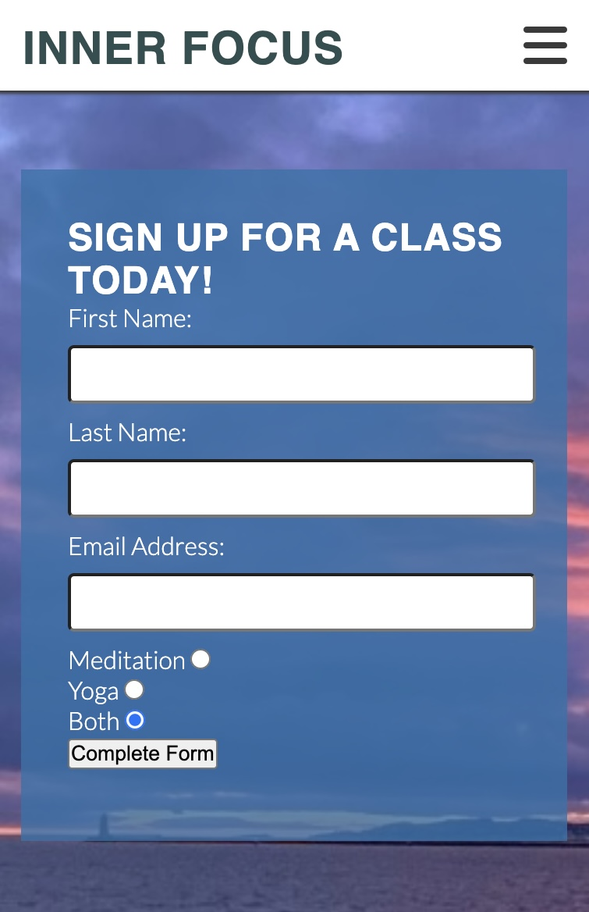

# Inner Focus
 
Welcome! [Inner Focus](https://conorm96.github.io/Project-1/)

Inner Focus is a Mindfulness centre located in Clontarf, Dublin 3.

Inner Focus educates its members on living healthier lifestyles by teaching Mind & Body techniques through Meditation and Yoga.

The main purpose of this website is to attract new customers who are looking to gain knowledge that can improve their lives and surround themselves with like minded people.

## User Experience (UX)
### Project Goals 
<li> The website should have a peaceful theme to it so customers feel at ease when they are introduced to it.
<li> Give an introduction of who Inner Focus is and what services they provide.
<li> Allow the customer to book in for a class of either Meditation, Yoga or both.

 
 ## Landing Page
 
 ### Navigation 
 <li> The navigation bar is in the header and can be found across all four pages of the website. It includes links to Home, Meditation, Yoga and the Sign Up page.

 ### Landing Page Image
 <li> The landing page image is of a person meditating looking out at a magnificent world. It's to give the customer a feeling of positivity and zen.

 ### Landing Page Welcome Message
 
 <li> The welcome message gives an insight into Mindfulness activities and invites people of all ages to come and book a class.

 ### About Us (contact info) 
 
 <li> This provides the customer with all the information they need regarding opening/closing times and contact details and address.

 ### Footer
 <li> The footer contains social media logos which are as external links.

## Meditation Page
### Meditation Image 
 
 <li> When the customer opens the meditation page they will see this image of a woman who is meditating by the beach.

 ### Meditation Benefits List
  
  <li> This list of health benefits will educate and entice the customer into digging a bit deeper into the benefits of meditation.
  <li> Reference: Meditation Benefits List taken from "https://www.forbes.com/health/mind/benefits-of-meditation/"

  ### Meditation Tutorial
   
<li> This short clip will give the customer a better idea as to how to meditate and what to expect when they come to a class.

## Yoga Page 
### Yoga Image
 
 <li> When the customer opens the Yoga page they will see a group of Women taking part in a yoga class.

 ### Yoga Benefits List
 
 <li> This list of yoga health benefits will entice the customer into wanting to learn more about yoga.

 ### Yoga Tutorial
 
 <li> This 5 minute morning yoga video is a good demonstration for beginners as to what yoga is and how simple and effective it is.

## Sign Up Page
 
<li> This page allows customers to sign up for some mindfulness classes. The customer has the option of Meditation, Yoga or both.

 

 ## Testing
### Device Compatibility
<li>This website has been tested on a MacBook Pro 14, No responsiveness, functionality or appearance issues found.

<li>This website has been tested on a iPhone 12 pro, No responsiveness, functionality or appearance issues found.

<li>This website has been tested on a iPhone 12 pro, No responsiveness, functionality or appearance issues found.

<li>This website has been tested on a pixel 7, No responsiveness, functionality or appearance issues found.

<li>This website has been tested on a iPad, No responsiveness, functionality or appearance issues found.

### Browser Compatibility
<li> This website was tested on Google Chrome, No responsiveness, functionality or appearance issues found.
<li> This website was tested on Safari, No responsiveness, functionality or appearance issues found.

### Code Validation 
HTML/CSS
<li> All pages have been put through WC3 MarkupValidaton, no errors found.
<li> Unfixed- 1 warning: "Section lacks heading. Consider h2-h6 elements to add identifying headings to all sections, or else use a div element instead for any cases where no heading is needed."
<li> All CSS have have been put through WC3 CSS validator, No errors or warnings found.

## Technologies Used
### Languages Used
<li> HTML5
<li> CSS3

### Libraries and Programs Used

[TinyPNG](https://tinypng.com/) was used to optimise an image for the web. 
[Font Awesome](https://fontawesome.com/) icons where used to improve visual representation.  
[Google Fonts](https://fonts.google.com/) was used to primary and back up fonts.  
[WC3 Markup Validator](https://validator.w3.org/#validate_by_input) was used to validate any HTML.  
[WC3 CSS Validation Service](https://jigsaw.w3.org/css-validator/) was used to validate any CSS.  
[GitPod](https://www.gitpod.io/) was used to write code. 
[GitHub](https://github.com/) was used to store code.  
[Chrome Devtools](https://developer.chrome.com/docs/devtools) was used to isolate pieces of code and review and test.

## Credits
### Images 
<li> Meditation page image taken from "https://www.verywellmind.com/what-is-meditation-2795927"
<li> Yoga page image taken from "https://www.yogabasics.com/practice/meditation-basics/yoga-before-meditation/"

### Content (Benefits List)
<li> Meditation Benefits List taken from "https://www.forbes.com/health/mind/benefits-of-meditation/".
<li> Yoga benefits list taken from "https://www.hopkinsmedicine.org/health/wellness-and-prevention/9-benefits-of-yoga".

### iFrames
<li> Youtube video "How to meditate", "https://www.youtube.com/watch?v=oq6j9uWrcfg" by creator 'Lavendaire'.
<li> Youtube video "5 Minute Morning Yoga - Daily Stretching Routine" "https://www.youtube.com/watch?v=lBYbeDx-jiw" by creator 'Yoga with Kassandra'.
 

 ## Acknowledgements 
 <li> My Mentor, Marcel, for his feedback and advice.
 <li> Code Institute Tutor Support Team, for answering queries I had during the process.