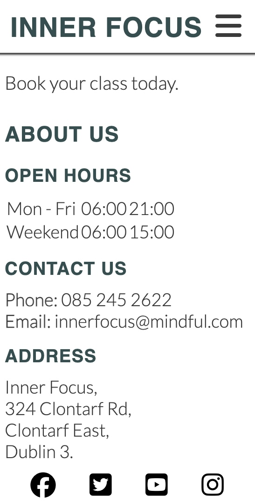

# Inner Focus
 
Welcome! [Inner Focus](https://conorm96.github.io/Project-1/)

Inner Focus is a Mindfulness centre located in Clontarf, Dublin 3.

Inner Focus educates its members on living healthier lifestyles by teaching Mind & Body techniques through Meditation and Yoga.

The main purpose of this website is to attract new customers who are looking to gain knowledge that can improve their lives and surround themselves with like minded people.

## User Experience (UX)
### Project Goals 
<li> The website should have a peaceful theme to it so customers feel at ease when they are introduced to it.
<li> Give an introduction of who Inner Focus is and what services they provide.
<li> Allow the customer to book in for a class of either Meditation, Yoga or both.

 
 ## Landing Page
 
 ### <li> Navigation 
 The navigation bar is in the header and can be found across all four pages of the website. It includes links to Home, Meditation, Yoga and the Sign Up page.

 ### <li> Landing Page Image
 The landing page image is of a person meditating looking out at a magnificent world. It's to give the customer a feeling of positivity and zen.

 ### <li> Landing Page Welcome Message
 
 The welcome message gives an insight into Mindfulness activities and invites people of all ages to come and book a class.

 ### <li> About Us (contact info) 
 
 This provides the customer with all the information they need regarding opening/closing times and contact details and address.

 ### <li> Footer
 The footer contains social media logos which are as external links.

## Meditation Page
### <li> Meditation Image 
 
 When the customer opens the meditation page they will see this image of a woman who is meditating by the beach.

 ### <li> Meditation Benefits List
  
  This list of health benefits will educate and entice the customer into digging a bit deeper into the benefits of meditation.

  ### <li> Meditation Tutorial
   
This short clip will give the customer a better idea as to how to meditate and what to expect when they come to a class.